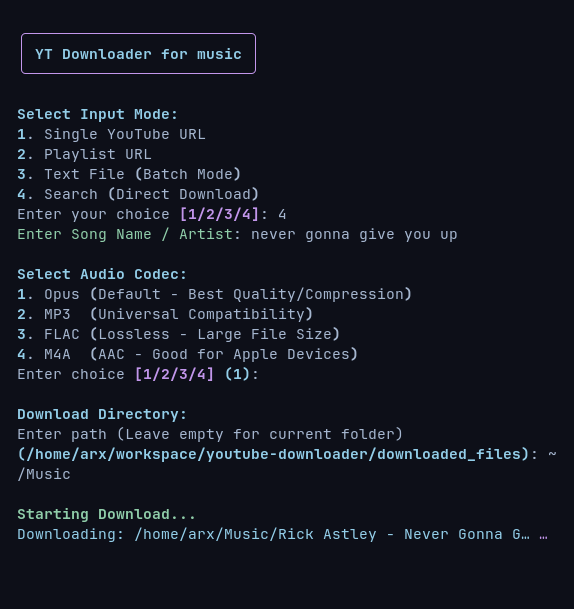

# YT Downloader for music

A robust, terminal-based utility designed for the automated extraction of high-fidelity audio from YouTube. Built on top of `yt-dlp` and wrapped in a modern Python `rich` TUI.

## Core Features


* **Audio Extraction:** Prioritizes Opus (WebM) direct stream copying. Supports Opus, MP3 (320kbps), FLAC, and M4A.
* **SponsorBlock Integration:** Automatically detects and cuts non-music segments (intros, skits, self-promotion) during processing.
* **Metadata Management:** Enforces `Title.ext` naming, embeds high-res album art and adds ID3 tags.
* **Network Optimization:** Uses concurrent fragment downloading (N=4) to mitigate connection throttling.
* **Authentication:** Supports browser cookie injection for direct search.
* **Artifact Cleanup:** Automatically removes temporary JSON files and loose playlist images.

### Requirements

* **Python:** 3.11+
* **System Dependencies:**
    * `ffmpeg` (Required for audio conversion/stream manipulation)
    * `node.js` (Required for complex YouTube signature deciphering)

## Installation

### clone the repo:

```bash
git clone https://github.com/ussooraj/ytdl-music.git
cd ytdl-music
```

### create venv (recommended)
### install necessary packages

```bash
pip install -r requirements.txt
```

*Required Python packages: `yt-dlp`, `rich`, `mutagen`*

## Usage

```bash
python main.py
```

## Input Modes

The downloader accepts various input formats to suit different use cases.

| Input Mode | Description | Example Input |
| :--- | :--- | :--- |
| **Single URL** | Download a specific individual track or video. | `https://www.youtube.com/watch?v=...` |
| **Playlist URL** | Download an entire album, EP, or curated playlist. | `https://www.youtube.com/playlist?list=...` |
| **Batch File** | Process a text file containing a list of URLs (one per line). | `batch_list.txt` (containing multiple URLs) |
| **Search** | Download the top result for a specific search query. | `Artist Name - Song Title` |

</br>

> [!NOTE]
> **Search (Direct Download)**
>
> ensure you are **logged into YouTube** on your preferred browser (Firefox/Chrome) before using this mode, as it relies on browser cookies for authentication.
> for Firefox, no additional setup is needed. 
> you can also change the browser in the `cookiesfrombrowser` option in the configuration section below.


## Configuration

Configuration options can be modified in [downloader.py](modules/downloader.py) within the `ydl_opts` dictionary.

| Option | Description | Music-Focused Examples |
| :--- | :--- | :--- |
| `format` | Audio format and quality preference. | `'bestaudio/best'` (.opus), `'mp3'`, `'m4a'`, `'flac'` |
| `outtmpl` | Filename template using metadata tags. | `'%(artist)s - %(title)s.%(ext)s'`, `'%(album)s/%(track_number)s - %(title)s.%(ext)s'` |
| `writethumbnail` | Download cover art (embedded or separate). | `True` (save cover art), `False` |
| `cookiesfrombrowser` | Use browser cookies for age-gated/premium music. | `'chrome'`, `'firefox'` (should be logged in) |


## License

This project is licensed under MIT, the terms specified in the [LICENCE](LICENCE) file.